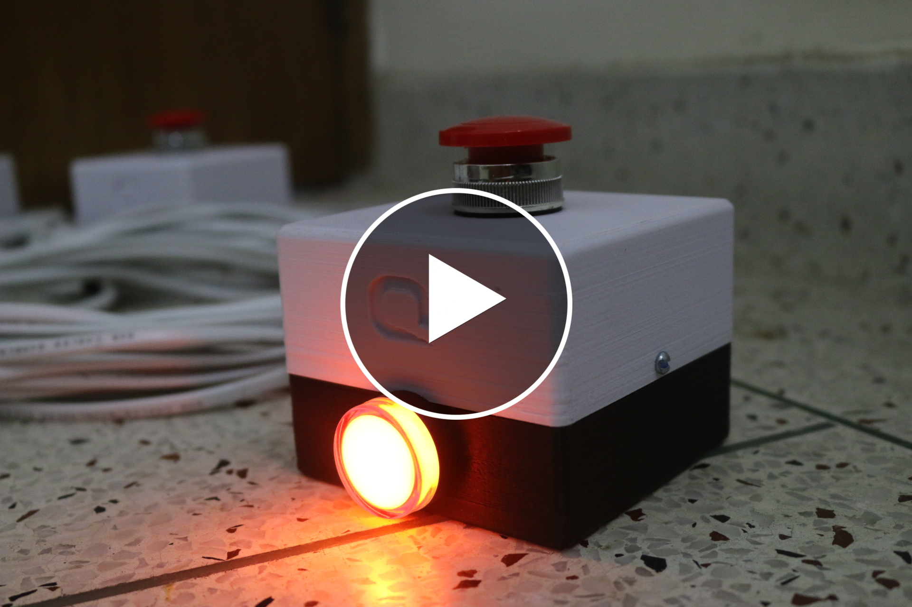

# QuizzoBuzz

This is a 6 terminal buzzer system for quiz competitions and has been used by Quanfield Technologies. The following applications are used for the development of this project.

- `Atmel Studio` - AVR Microcontroller Programming
- `Proteus Design Suite` - Designing the schematic and PCB layout
- `TinkedCad` - Terminal box design

**Developer:** Farhan Fuad Abir, Md. Ahasan Atick Faisal

**Novelty:** The control circuit which for implementing a two-wire bidirectional communication between a terminal and the control box.

## System Image
Terminals and the control box:

Control Box Schematic:

Control Box PCB Layout:

## Video Demostration

  

